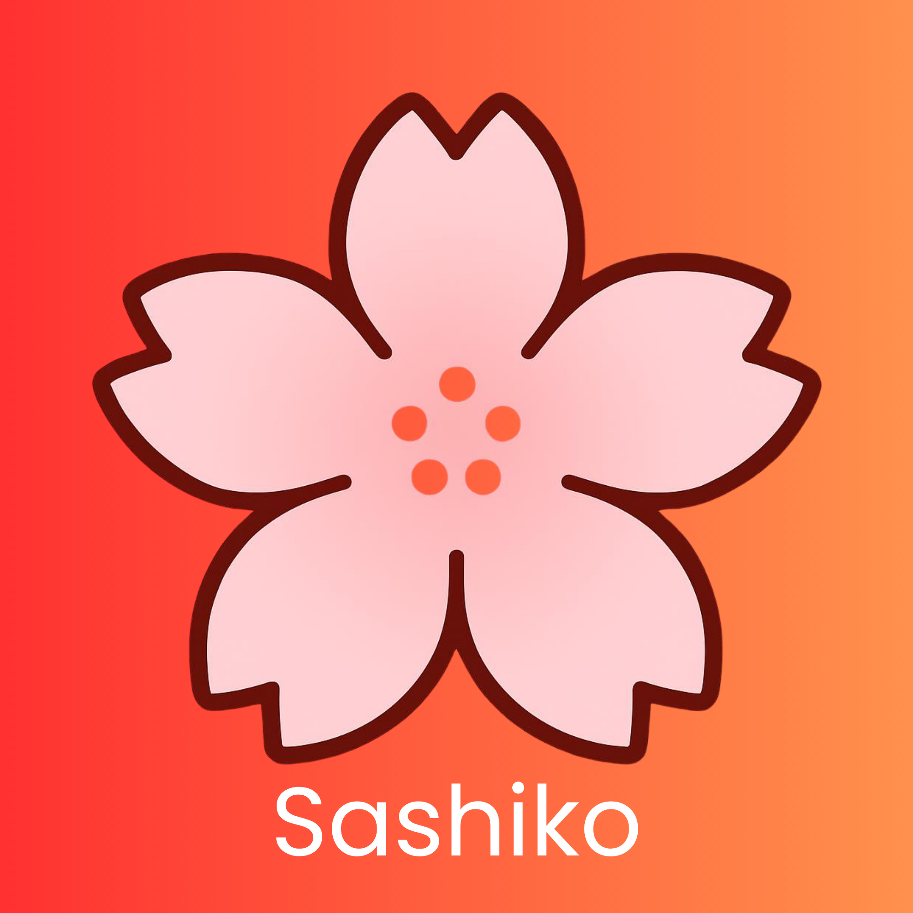

# 🌸 Sashiko — A Growing Ecosystem of Reusable .NET Utilities

  

Sashiko is an open‑source ecosystem of modular .NET libraries designed to make development faster, cleaner, and more enjoyable.
Inspired by the Japanese craft of sashiko stitching – a technique built on precision, structure, and beautiful patterns – this project aims to provide developers with a collection of reusable building blocks that “stitch together” the foundations of modern applications.

---

## 🧵 Current Threads (v0.1.x Alpha)
The ecosystem is currently in its early stages, focusing on the foundational patterns:

- **Sashiko.Core**: Essential utilities, math helpers, and shared primitives.
- **Sashiko.Validation**: Fluent and lightweight validation logic.
- **Sashiko.Registries**: Smart management of services and component registration.
- **Sashiko.SystemMonitor**: Cross‑platform hardware and OS monitoring.

---

## 🗺️ Roadmap
Sashiko is constantly growing. Upcoming modules include:

- **Sashiko.Languages**: A comprehensive registry of languages based on the official **ISO 639 (SIL)** standards, filling a gap in the current .NET ecosystem.
- **Sashiko.Names**: A cultural-aware name registry providing advanced features like random name generation based on language, culture, and gender identity.

---

Each Sashiko package is built to be:
- **Lightweight** and **modular**
- **Cross‑platform**
- **Easy to adopt**

The goal is simple:
to help developers around the world build faster, prototype smarter, and reuse high‑quality utilities across countless projects — from small experiments to large‑scale applications.

Sashiko is just getting started, and the pattern will continue to grow.

---

## 🚀 Get Involved
Whether you are building a small experiment or a large-scale application, these tools are designed to accelerate your development.

If you'd like to contribute, please check our [CONTRIBUTING.md](./CONTRIBUTING.md) file.

---

## 📧 Contact & Support
For questions, suggestions, or professional inquiries, feel free to reach out:

- **Email**: [sashiko@alex98luca.com](mailto:sashiko@alex98luca.com)
- **Author**: Alexandru Luca (alex98luca)
- **LinkedIn**: [Alexandru Luca](https://www.linkedin.com/in/alexandru-98-luca)

---

## ⚖️ License
Licensed under **Apache License 2.0**.  
*Note: Branding assets in the `/assets` directory are proprietary. See [/assets/ASSETS-LICENSE.md](./assets/ASSETS-LICENSE.md) for details.*
